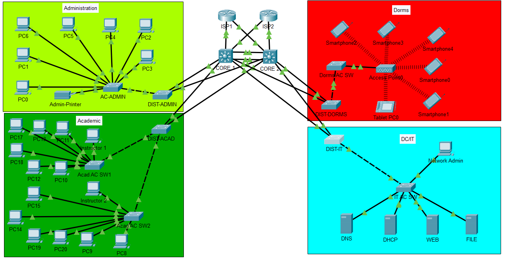

# Network Overview

This project implements a redundant campus-style network architecture using dual-core Layer 3 switches, dynamic routing at the edge, and Layer 2 resiliency mechanisms.

---

## High-Level Topology



The design follows a hierarchical model:

- Access Layer (Department switches)
- Distribution Layer
- Dual Core Layer (Layer 3 switching)
- Dual Edge Routers (Upstream connectivity)

---

## VLAN Segmentation

| VLAN | Name       | Subnet           | Purpose              |
|------|------------|------------------|----------------------|
| 10   | Admin      | 10.10.10.0/24    | Administration PCs   |
| 20   | Staff      | 10.10.20.0/24    | Staff Systems        |
| 30   | Students   | 10.10.30.0/24    | Academic Devices     |
| 40   | Dorms      | 10.10.40.0/24    | Wireless Clients     |
| 50   | Servers    | 10.10.50.0/24    | Infrastructure VLAN  |
| 99   | IT Mgmt    | 10.10.99.0/24    | Network Management   |

Each VLAN uses an SVI on both core switches with HSRP providing gateway redundancy.

---

## IP Addressing Plan

IP addressing follows a predictable pattern:

```
10.10.<VLAN_ID>.0/24
```

This allows for:

- Simple subnet identification
- Logical segmentation alignment
- Easier ACL implementation
