# Resiliency Tests

## HSRP Failover and Recovery Validation

This section documents controlled failure testing of the dual-core HSRP design to validate gateway redundancy, convergence behavior, and load redistribution.

---

## 1. Baseline Connectivity (Pre-Failure)

With both core switches operational and HSRP load balancing active, client connectivity was verified to:

- Server VLAN (10.10.50.0/24)
- Inter-VLAN gateways
- Simulated Internet (203.0.113.1)
- Cross-VLAN routing via SVIs

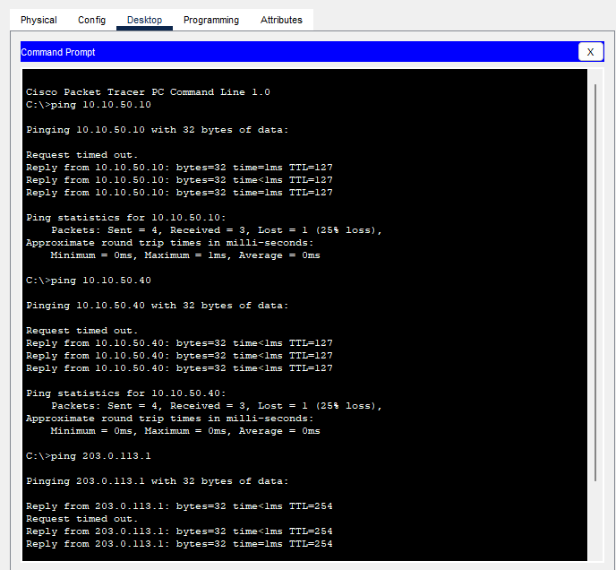

HSRP state verification:

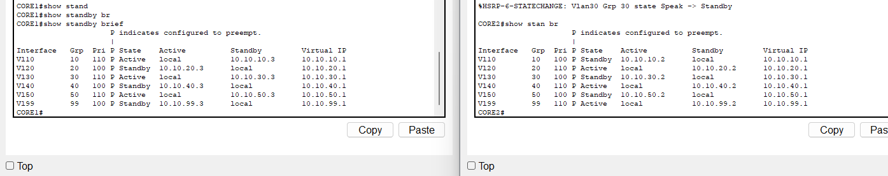

**Result:**  
All VLANs had an active gateway and properly configured standby peer.

---

## 2. Core 1 Failure Simulation

CORE1 was administratively shut down to simulate primary core failure.

Observed behavior:

- All uplinks to CORE1 transitioned down
- Traffic paths shifted to CORE2
- No manual configuration changes were required

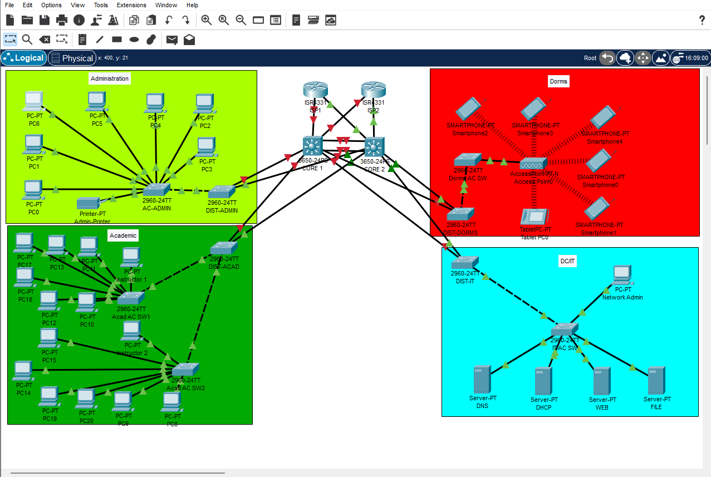

**Result:**  
Redundant core architecture maintained Layer 3 availability.

---

## 3. Standby Takeover Verification

After CORE1 shutdown, CORE2 transitioned from Standby → Active for all VLAN groups.

`show standby brief` confirmed state transitions and preservation of all virtual IP addresses.

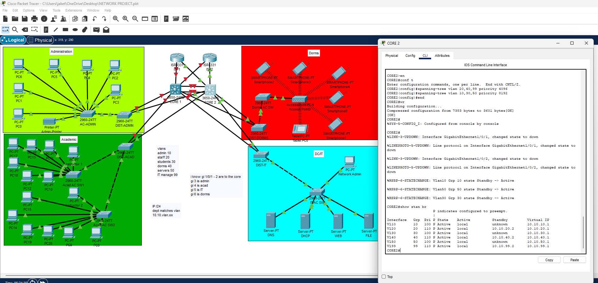

**Result:**  
HSRP failover occurred immediately and correctly.

---

## 4. Client Connectivity During Failure

Client connectivity was tested continuously during the failure window.

Observed behavior:

- One dropped packet during reconvergence (expected behavior)
- Immediate restoration of connectivity
- Continued access to servers and simulated internet

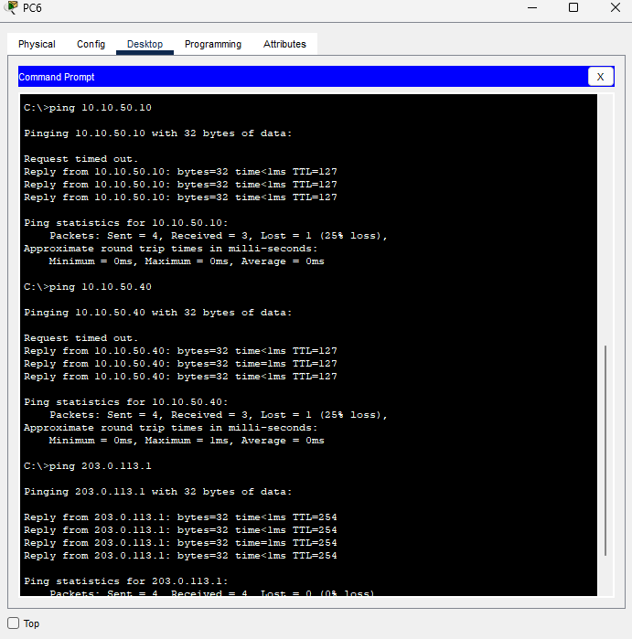

> **Note on Simulated Internet Testing**
>
> Internet reachability in this lab is simulated using loopback interfaces on the edge routers.
>
> - During baseline testing, traffic to `203.0.113.1` was routed toward CORE1’s upstream path.
> - During the CORE1 failure scenario, the simulated internet test was performed against the loopback reachable via CORE2.
>
> This design allows controlled validation of upstream routing behavior without requiring external connectivity. The IP `203.0.113.1` represents a simulated external destination for resiliency validation purposes.

**Result:**  
No sustained user impact during core failure.

---

## 5. Core Recovery and Load Rebalancing

CORE1 was restored to service.

Due to configured HSRP priority and preemption:

- VLAN gateway ownership redistributed automatically
- Load-balanced design was restored
- Active/Standby roles returned to intended state

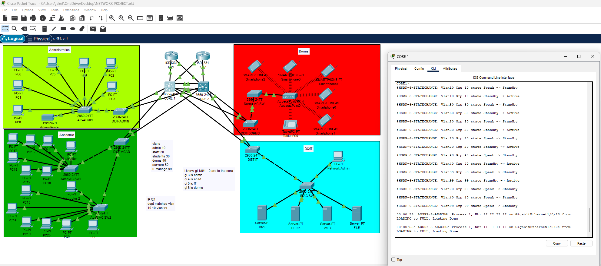

**Result:**  
Automatic recovery and redistribution confirmed. No manual intervention required.

---

## Summary of Validated Behaviors

The following resiliency characteristics were confirmed:

- Dual-core gateway redundancy
- Proper HSRP state transitions
- Virtual IP stability during failover
- Minimal convergence loss (single dropped ping)
- Automatic load redistribution after recovery
- No single point of failure at the core layer

The campus architecture successfully maintains Layer 3 gateway continuity during core outages and restores intended load-balanced operation upon recovery.
---

## EtherChannel Resiliency Validation

This section documents controlled failure testing of the core EtherChannel bundle to validate Layer 2 link aggregation behavior, traffic continuity, and automatic member recovery.

---

### 1. Baseline Port-Channel State

The EtherChannel bundle (Port-channel1) was verified in a healthy state using:
```
show etherchannel summary
```

Observed state:

- Port-channel in use (SU)
- Both member interfaces bundled (P)
- No suspended or misconfigured members

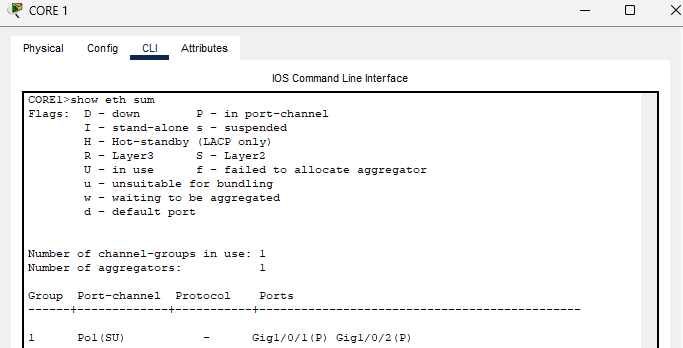

**Result:**  
Port-channel operational with full link redundancy.

---

### 2. Single Member Link Failure

One physical member interface of the EtherChannel bundle was administratively shut down.

Observed state:

- One member flagged (D) – down
- Remaining member stayed bundled (P)
- Port-channel remained operational (SU)

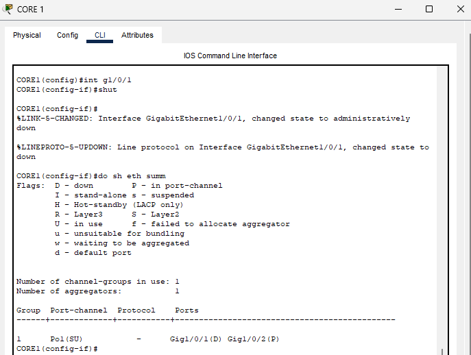

**Result:**  
Logical Port-channel remained up despite physical link loss.

---

### 3. Path Isolation Test

To eliminate alternate routing paths and ensure traffic traversed the EtherChannel bundle:

- Distribution uplinks to alternate core paths were shut down
- Traffic was forced across the remaining EtherChannel member

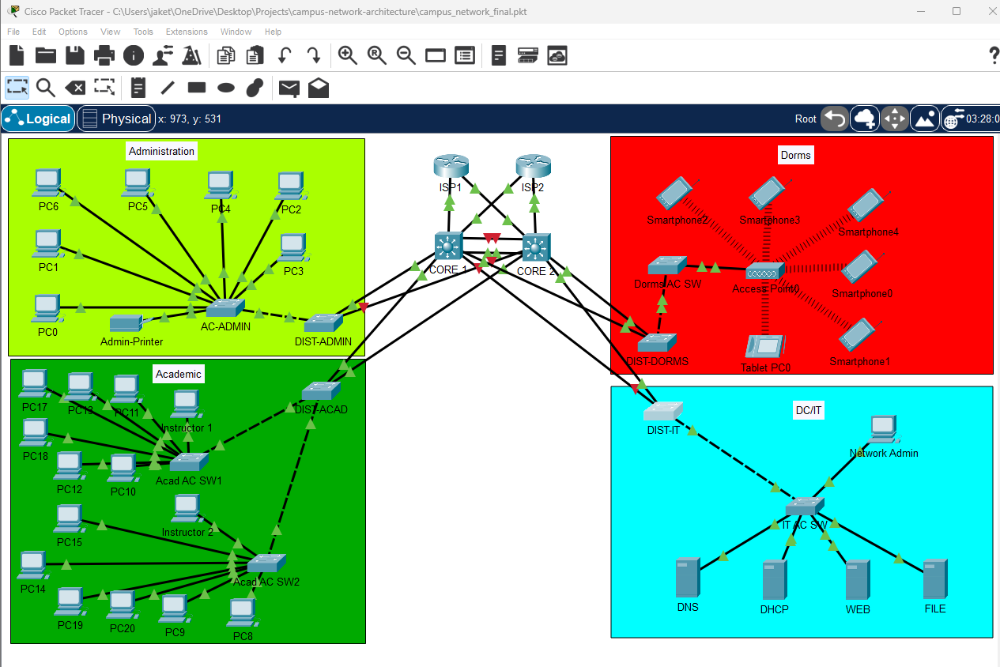

**Result:**  
Traffic successfully constrained to the EtherChannel path without topology collapse.

---

### 4. Client Connectivity During Member Failure

Client connectivity was tested while:

- One EtherChannel member was down
- Alternate distribution paths were disabled

Observed behavior:

- 0% packet loss
- Stable latency
- No noticeable service interruption

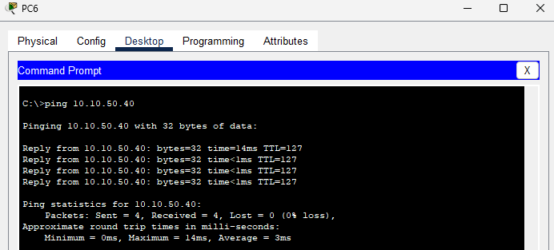

**Result:**  
Layer 2 link aggregation successfully preserved data-plane continuity during physical link failure.

---

### 5. Member Restoration and Rebundling

The failed member interface was restored.

Observed state:

- Interface returned to bundled (P)
- Port-channel resumed full redundancy
- No manual reconfiguration required

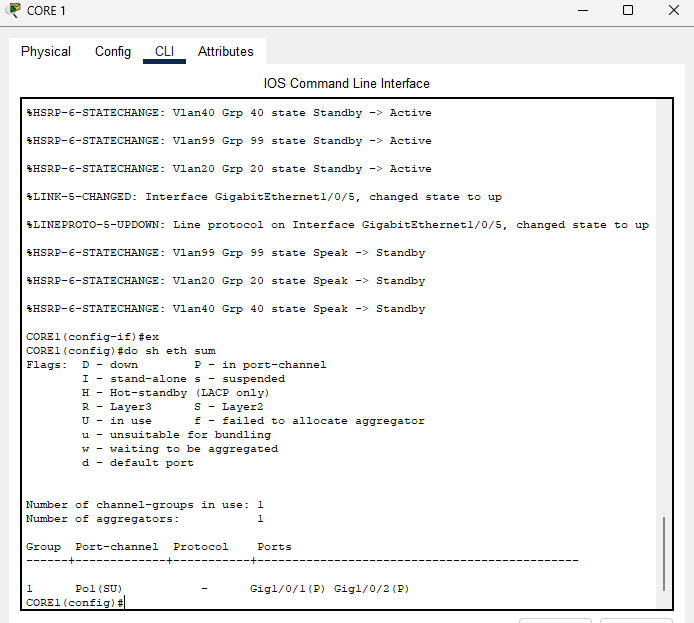

**Result:**  
LACP automatically re-established full aggregation and redundancy.

---

## Summary of Validated Behaviors

The following EtherChannel resiliency characteristics were confirmed:

- Port-channel remains operational with single member failure
- No Layer 2 service interruption during link loss
- Traffic continuity under forced path isolation
- Automatic LACP rebundling upon interface restoration
- No single point of failure within aggregated uplink

The EtherChannel implementation successfully provides link-level redundancy and traffic stability within the core distribution architecture.

---

## OSPF Edge Router Failover and Recovery Validation

This section documents controlled failure testing of the dual-edge OSPF design to validate upstream redundancy, adjacency convergence, and continued external reachability.

---

### 1. Baseline OSPF Adjacency State

With both edge routers operational, the core switch maintained full OSPF neighbor adjacencies to both upstream routers.

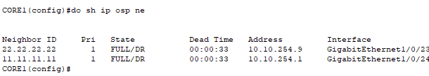

**Result:**
- Both neighbors in `FULL` state
- Stable dead timers
- Dual upstream routing paths available

---

### 2. Edge1 Failure (Adjacency Loss)

ISP1 (Edge1) interfaces were administratively shut to simulate an upstream router failure.

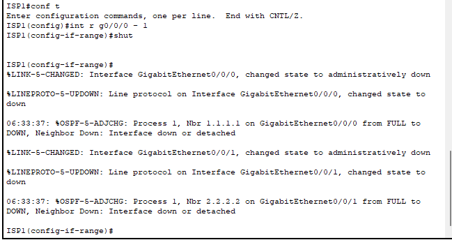

OSPF immediately detected the link-down event and removed the adjacency.

On the core switch:

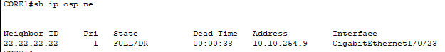

**Observed Behavior:**
- Neighbor transitioned from `FULL` → `DOWN`
- Remaining edge router adjacency remained `FULL`
- OSPF process continued operating normally

---

### 3. Client Connectivity During Edge Failure

A client device was used to validate external reachability during the failure condition.

The ISP2 loopback (203.0.113.2) was used to simulate Internet traffic.

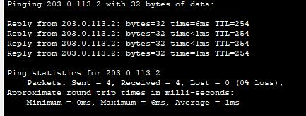

**Result:**
- 0% packet loss
- Successful reachability to upstream router
- No interruption to external connectivity

This confirms traffic was successfully rerouted via the remaining edge router.

---

### 4. Edge1 Recovery and Adjacency Restoration

Edge1 interfaces were restored to service.

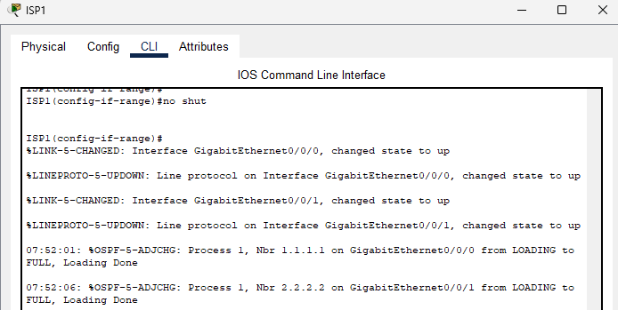

OSPF automatically re-established adjacency:

- Neighbor state transitioned from `LOADING` → `FULL`
- No manual routing intervention required
- Dual-edge topology restored

---

### Validation Summary

The dual-edge OSPF design successfully demonstrated:

- Immediate adjacency removal on upstream failure
- Preservation of alternate routing path
- Continued client connectivity during edge outage
- Automatic adjacency restoration upon recovery
- Stable and predictable control-plane behavior

This validates proper OSPF configuration and confirms that the upstream redundancy design functions as intended.

---

## Spanning Tree (STP) Link Failure and Reconvergence Validation

This section documents controlled Layer 2 failure testing to validate proper STP loop prevention, alternate path activation, and traffic restoration behavior within VLAN 20.

---

### 1. Baseline STP State (VLAN 20)

With all uplinks operational, DIST-IT showed the following STP topology for VLAN 20:

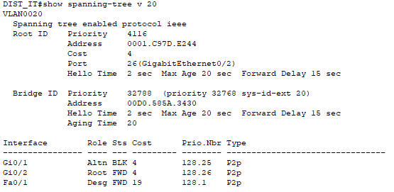

**Observed Baseline Behavior:**

- One port in `Root FWD` state
- One port in `Altn BLK` state
- Deterministic root bridge selection
- Loop prevention functioning correctly

This confirms redundant Layer 2 paths were present and properly controlled by STP.

---

### 2. Root Port Failure Simulation

To simulate a link failure, the active root-facing interface on DIST-IT was administratively shut:

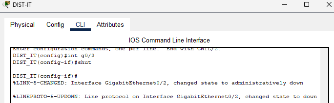

This action removed the active root path and forced STP to reconverge.

---

### 3. STP Reconvergence State

After the failure, STP recalculated the topology:

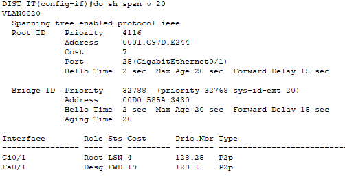


**Observed Behavior:**
 
- Former alternate port transitioned to `Root`
- New path cost recalculated
- No loop formation
- Stable forwarding state achieved

This confirms proper alternate path activation and predictable reconvergence.

---

### 4. Client Connectivity During STP Reconvergence

A VLAN 20 client was used to validate real traffic behavior during the topology change.

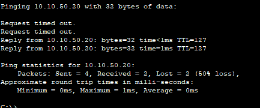

**Result:**

- Initial packet loss observed during reconvergence
- Subsequent packets delivered successfully
- Connectivity restored automatically

Temporary packet loss during STP reconvergence is expected behavior and confirms that the topology change event was properly handled.

---

### Validation Summary

The STP design successfully demonstrated:

- Loop prevention under normal operation
- Controlled alternate path activation during link failure
- Automatic reconvergence without manual intervention
- Restoration of client-to-server communication
- Stable Layer 2 topology following failure

This validates correct implementation of redundant Layer 2 uplinks and predictable STP behavior within the campus architecture.

## Overall Resiliency Validation

The campus network architecture successfully demonstrated:

- Redundant default gateway failover via HSRP
- Dynamic route convergence via OSPF
- Layer 2 loop prevention and alternate path activation via STP
- Link aggregation resiliency via EtherChannel
- End-to-end client connectivity during all failure conditions

All failover scenarios were validated using controlled shutdown testing and client-level connectivity verification.
